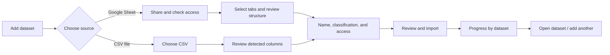

# Unify dataset onboarding

**Status:** Implemented and verified
**Priority:** P1
**Effort:** L
**Risk:** Medium
**Confidence:** High
**Category:** Product direction / UX architecture / technical debt
**Planned against:** `6ce25c4` (`main`), reviewed 2026-07-16

## Outcome

Create one calm, guided, administrator-only **Add dataset** experience at
`/dashboard/datasets/new`. A person should be able to connect a Google Sheet or
upload a CSV without understanding API connections, run pipelines, storage, or
provider internals.

The completed experience must:

1. explain what will happen before asking for technical input;
2. present one primary decision per step;
3. detect Google Sheets headers automatically and request manual review only
   when confidence is low or the user chooses to review them;
4. allow the imported dataset name, classification, and workspace visibility to
   be reviewed before creation;
5. connect and import a Google Sheet in one guided journey;
6. show progress and per-dataset completion or recovery actions;
7. keep data-source operations and run diagnostics available, but outside the
   onboarding flow.

No Google OAuth or Drive browser is required for this change. Google Sheets
continue to use the configured service account.

## Why this is the right change

### Live product evidence

The production review of `https://data.accelerateglobal.org/dashboard/api-connections`
on 2026-07-16 showed three unrelated jobs stacked on one page:

- an **Add Google Sheet** form;
- a **Connections** inventory containing both code-managed APIs and Google Sheet
  tabs; and
- a **Resources** inventory for documents captured by API runs.

The page is titled **Datasets**, but its description says, “Run code-managed API
connections and import responses into shared datasets.” The connection form
places service-account instructions and the URL field side by side, then expands
tab selection, header previews, visibility, classification, and submission into
the same card. This makes the page grow substantially at the moment a new user
needs the strongest sense of direction.

The production CSV page at `/dashboard/upload` is separate and behaves
differently: classification appears before file selection, the file name becomes
the dataset name without review, and the copy says the upload is “for everyone
to view.” There is no shared mental model between connecting a Sheet and
uploading a file.

### Repository evidence

- `src/app/dashboard/api-connections/page.tsx` renders a `Datasets` heading and
  the operational description before mounting `ApiConnectionsClient`.
- `src/components/dashboard/api-connections-client.tsx` owns setup state,
  connection inventory, and resource inventory in one 800+ line component.
- The connect success path immediately routes to
  `/dashboard/api-connections/{connectionId}` instead of importing the Sheet or
  explaining the next action.
- `src/components/dashboard/api-connection-detail-client.tsx` gives primary
  visual weight to five disabled “Skeleton / Coming soon” pipeline stages before
  the user reaches run detail and history.
- `src/components/dashboard/google-sheets-header-selection.tsx` correctly
  supports automatic detection, manual row selection, and one-to-three combined
  header rows, but always displays a full-width sample table inline.
- `src/components/dashboard/dataset-upload-client.tsx` already contains a sound
  streaming CSV upload implementation, but presentation and processing are
  tightly coupled.
- `src/lib/api-connections/index.ts` already stores a stable Sheet/tab identity,
  confirmed header configuration, target dataset name, classification, and
  initial visibility. The onboarding change can reuse this domain behavior.
- `src/app/api/admin/api-connections/[connectionId]/run/route.ts` already queues
  an import with `{ importEnabled: true }`; no new run engine is needed.

## Product principles

1. **Dataset language first.** Say “Add dataset,” “Google Sheet,” “CSV file,”
   and “Import.” Reserve “connection,” “provider configuration,” and “run” for
   the management surfaces.
2. **Progressive disclosure.** A high-confidence header recommendation is a
   short success summary, not a large table. Full header controls and the sample
   grid appear on request or when confidence requires attention.
3. **Explicit outcomes.** Source access and imported-dataset access are separate
   concepts. The service account reads the source Sheet; workspace visibility
   controls who can see the imported dataset.
4. **Safe reversibility.** Back navigation preserves completed input. Nothing is
   persisted until the final import action, except the uploaded CSV object when
   its existing processing sequence begins.
5. **Operational details are secondary.** Run logs, artifacts, refresh history,
   and resource capture remain available after onboarding without competing
   with it.

## Target user flow



### Step 1 — Choose a source

Show two supported choices in a narrow, single-column page shell:

- **Google Sheet** — “Keep the Sheet in Google and refresh it later.”
- **CSV file** — “Upload a snapshot from your computer.”

Do not show a generic API source. The OpenSpec contract intentionally keeps
generic API profiles code-managed. Existing API integrations belong in the
Data sources management page.

### Step 2 — Connect or choose the source

For Google Sheets:

- show a numbered two-action instruction: share the Sheet as Viewer, then paste
  its URL;
- keep the app email and copy action together;
- use one primary **Check access** action;
- after success, replace the instructions with a compact confirmation containing
  the spreadsheet title and an **Use a different Sheet** action.

For CSV:

- show only the drop zone/file picker;
- validate file type and size immediately;
- display the selected filename and size before continuing;
- do not start the upload until the final import step.

### Step 3 — Select content and review structure

For Google Sheets:

- list readable tabs with search when there are more than ten;
- retain multi-select, but describe it as an advanced convenience: each tab
  becomes a separate dataset;
- load header previews for selected tabs using the existing endpoint;
- render a compact status row per tab: detected header row(s), confidence,
  resulting column count, and **Review headers**;
- automatically expand the header editor when confidence is not high;
- preserve the existing one-to-three combined-header-row behavior;
- show at most the first six columns and two data rows in the inline preview,
  with **View all columns** opening a smoke-covered dialog or sheet.

For CSV:

- parse and show the detected first-row columns without uploading;
- show the same compact column-preview vocabulary where practical;
- keep custom CSV header-row selection out of this change unless product
  examples prove it is required. Google Sheets multi-row headers are already an
  established requirement; CSV files currently have a first-row contract.

### Step 4 — Dataset details and access

For every dataset that will be created, show an editable **Dataset name** with a
source-derived default. For a multi-tab Sheet, show one name field per selected
tab and validate uniqueness within the batch.

Show shared settings once below the names:

- **Classification:** PGAC or PGIC, using the existing tag vocabulary and a
  one-sentence explanation for each option;
- **Who can see the imported dataset:** two explicit radio cards,
  **Everyone in the workspace** and **Only administrators**;
- when the private choice is selected, show the existing red system-managed
  `Private` tag and explain that the source Sheet sharing is unchanged.

Keep the current workspace-visible default for backward compatibility, but make
the selected outcome visible in the review summary. Do not use an unlabeled or
inverted privacy switch.

### Step 5 — Review, import, and finish

The review screen summarizes source, selected tabs/file, detected header rows,
dataset names, classification, and access. The only primary action is:

- **Connect and import datasets** for Google Sheets;
- **Upload dataset** for CSV.

For Google Sheets, reuse the existing connect endpoint, then start an import run
for every returned connection through the existing run endpoint. Show each
dataset as `Connecting`, `Queued`, `Importing`, `Ready`, or `Needs attention`.
Poll the existing run detail endpoint and expose:

- **Open dataset** for a successful item;
- **Retry import** for a connection created successfully whose import failed;
- a redacted error and **Review source settings** when access/header validation
  failed;
- **Open data source** as a secondary diagnostics link.

A failure in one selected tab must not hide successful siblings. The completion
screen remains usable until every item is either ready or visibly actionable.

## Information architecture changes

### New onboarding route

Add `src/app/dashboard/datasets/new/page.tsx`:

- administrator-only, matching current upload and API Connections access;
- literal `data-smoke-page="dataset-onboarding"` and
  `data-smoke-page-ready="dataset-onboarding"` markers;
- a simple page title, short outcome statement, accessible stepper, and one
  bounded content surface (`max-w-3xl` is an appropriate target);
- optional `?source=google-sheets` or `?source=csv` deep links;
- `?replace={datasetId}` is not supported here in the first release—replacement
  stays in the established upload path.

### Dashboard entry point

Update `src/components/dashboard/datasets-grid.tsx` to give administrators one
prominent **Add dataset** action beside the Datasets heading. Do not add separate
Google Sheets and CSV buttons on the dashboard.

### Data sources management

Refocus `/dashboard/api-connections` as **Data sources**:

- remove the inline Add Google Sheet form;
- retain the connections inventory and an **Add dataset** link to the new flow;
- keep Resources in a secondary section or separate route, not ahead of source
  management actions;
- rename “Private Google Sheet tab” copy to “Google Sheet source” so it does not
  imply that the imported dataset is private;
- preserve existing row navigation and admin authorization.

On the connection detail page:

- lead with source identity, current dataset, last refresh, and actions;
- replace the five disabled pipeline cards with a compact status timeline or
  remove them until independent stages exist;
- keep run detail, history, and artifact downloads collapsed under
  **Diagnostics**;
- keep **Review headers**, **Check access**, **Refresh**, and **Disconnect**.

### Legacy URL behavior

- `/dashboard/upload` without `replace` redirects to
  `/dashboard/datasets/new?source=csv`.
- `/dashboard/upload?replace={id}` continues to render the current replacement
  flow to avoid broadening the onboarding change into version-management work.
- `/dashboard/api-connections` remains a stable management URL; it does not
  redirect.

## Component architecture

Create a focused feature directory rather than expanding the current large
clients:

```text
src/components/dashboard/dataset-onboarding/
  dataset-onboarding-client.tsx
  dataset-onboarding-reducer.ts
  onboarding-stepper.tsx
  source-choice-step.tsx
  google-sheets-access-step.tsx
  google-sheets-structure-step.tsx
  csv-source-step.tsx
  dataset-details-step.tsx
  onboarding-review-step.tsx
  onboarding-progress-step.tsx
  onboarding-types.ts
```

Use a reducer with a discriminated state rather than another collection of
independent booleans. The state model should distinguish:

```ts
type OnboardingStage =
  | "source"
  | "connect"
  | "structure"
  | "details"
  | "review"
  | "import"
  | "complete";
```

Reducer invariants:

- a stage can only advance when its validation is complete;
- changing the source clears source-specific state;
- changing the Sheet URL clears access, tab, and header state;
- deselecting a tab clears only that tab's name and header state;
- back navigation never clears valid downstream-independent input;
- the import stage cannot transition backward after connections or dataset
  creation begins;
- async responses carry a request key so stale header/access responses cannot
  overwrite newer input.

Extract processing from `DatasetUploadClient` into reusable functions/hooks, but
keep the existing replacement UI working. Reuse
`GoogleSheetsHeaderSelection`; add compact and expanded presentation modes
instead of duplicating header-selection logic.

Do not create a new shared primitive under `src/components/ui` unless necessary;
new shared primitives require colocated smoke fixtures.

## API and domain changes

### Custom names for Google Sheet tabs

Extend the Google Sheets connect contract with an optional, backward-compatible
per-tab settings array:

```ts
datasetSettings?: Array<{
  sheetId: number;
  datasetName: string;
}>;
```

Validation requirements:

- every supplied `sheetId` is selected exactly once;
- names are trimmed, 1–255 characters, unique case-insensitively within the
  request, and sanitized using the existing dataset-name rules;
- an omitted array preserves the current derived-name behavior for legacy
  callers;
- conflicts with active Sheet/tab connections continue to reject the atomic
  connection batch before any new rows are written.

Update `createGoogleSheetsConnections` to use the reviewed name for both the
connection's human-readable name and `datasetName`, while retaining spreadsheet
and tab identity in provider configuration. No database migration is expected:
the existing connection `name`/`datasetName` and dataset `fileName` fields can
hold this value.

### CSV names and visibility

Extend `createDatasetSchema` and `createDatasetRecord` to send the reviewed
dataset name and `isWorkspaceVisible`. Preserve the original local filename in
analytics only if permitted by the current privacy policy; do not add a new
database field solely for onboarding. The existing `createDataset` function
already accepts initial visibility.

### Import orchestration

Do not create a second ingestion engine. The onboarding client should:

1. POST the reviewed Google Sheet configuration to the existing connect route;
2. POST `{ "importEnabled": true }` to each returned connection's existing run
   route;
3. poll each returned run using the existing run-detail route;
4. update each result independently and link successful `datasetId` values.

Guard the transition so a double-click cannot create duplicate connections.
Once the connect request succeeds, retries must retry only failed imports, never
resubmit the connect request. Add a recovery test for a successful connection
followed by a failed import request.

### Analytics

Record the funnel without sending Sheet URLs, tab names, dataset names, column
labels, or file contents:

- onboarding viewed;
- source selected;
- source access checked / file validated;
- structure accepted or manually changed;
- review reached;
- import started, completed, or failed;
- source type, selected-tab count, header-confidence category, duration, and
  failure stage.

Avoid double-counting the existing CSV upload events when the reusable upload
engine is called from onboarding.

## Accessibility and responsive behavior

- The stepper uses an ordered list and `aria-current="step"`.
- Every step has one `<h2>`; focus moves to it after forward/back navigation.
- Validation failures produce an error summary linked to invalid fields.
- Enter does not accidentally submit while a header preview is still loading.
- Loading states preserve button width and announce status through a polite live
  region.
- Compact summaries remain readable at 320 px; settings stack vertically and no
  full data table is required to complete the flow on mobile.
- The expanded column preview is keyboard dismissible and restores focus to its
  trigger.
- Primary actions use outcome language, never “Next” on the final action.

## OpenSpec work

Before implementation, create one OpenSpec change named
`unify-dataset-onboarding` with this scope:

> Add an administrator-only guided Add dataset workflow that unifies Google
> Sheets connection and CSV upload entry points; progressively reviews source
> access, detected headers, dataset names, classification, workspace visibility,
> and import progress; separates onboarding from API connection operations; and
> preserves existing service-account, header-detection, visibility, run,
> security, and backward-compatibility behavior.

The change should add a focused `dataset-onboarding` capability and modify the
relevant requirements in:

- `openspec/specs/api-connection-runs/spec.md`;
- `openspec/specs/authenticated-dataset-access/spec.md`;
- `openspec/specs/dashboard-layout/spec.md`.

Explicitly preserve:

- admin-only mutations;
- same-origin API protections;
- service-account credentials remaining server-side;
- current workspace-visible default and legacy fallback;
- private-tag invariants;
- one connection per stable Google `sheetId`;
- no generic API-profile creation through the web UI.

## Implementation sequence

### 0. Establish a clean baseline

1. Land, commit, or isolate the existing Google Sheets visibility and private-tag
   work. It is a prerequisite, not part of this plan.
2. Run `git status --short` and stop if any in-scope path is unexpectedly dirty.
3. Re-read the in-scope excerpts below and update this plan if they drifted.
4. Create the OpenSpec change and validate its artifacts.
5. Run:

   ```bash
   pnpm run verify:change
   pnpm run task:kickoff -- --scope 'src/app/dashboard/datasets/new/**,src/components/dashboard/dataset-onboarding/**,src/components/dashboard/api-connections-client.tsx,src/components/dashboard/api-connection-detail-client.tsx,src/components/dashboard/dataset-upload-client.tsx,src/lib/api-connections/index.ts,src/app/api/admin/api-connections/google-sheets/connect/route.ts,src/lib/validation.ts,src/app/api/datasets/route.ts,tests/ui/**'
   ```

Local Supabase should not be required by the product change because no schema
migration is expected. If implementation reveals a data-model need, stop and
amend OpenSpec and this plan before adding a migration.

### 1. Add the onboarding shell and reducer

- Add the new page and feature directory.
- Implement route authorization, source deep links, step validation, focus
  management, back behavior, and smoke markers.
- Add dashboard **Add dataset** entry.
- Add reducer and component tests before connecting live APIs.

### 2. Move Google Sheets setup into the flow

- Extract access-check and header-preview calls from
  `ApiConnectionsClient` into feature-scoped service functions.
- Implement the compact tab/header review and expanded editor.
- Preserve stale-response and confidence handling.
- Add editable per-tab dataset names and shared classification/access settings.
- Keep the old page functional until the new journey is browser-verified.

### 3. Connect and auto-import

- Extend the connect schema/domain for optional custom names.
- Chain existing import runs after successful connection creation.
- Implement independent status polling, success links, import-only retry, and
  partial-failure presentation.
- Only after this passes direct tests, remove the inline creation card from
  `ApiConnectionsClient`.

### 4. Integrate CSV without breaking replacement

- Extract reusable CSV validation/upload/parse/persist behavior.
- Add selected-file, structure summary, editable name, classification, and access
  to onboarding.
- Keep `/dashboard/upload?replace=` behavior and tests intact.
- Redirect only new-upload traffic to the onboarding route.

### 5. Simplify management surfaces

- Rename API Connections page copy to Data sources.
- Separate or demote Resources.
- Replace disabled pipeline skeletons with a compact real status summary and a
  Diagnostics section.
- Update existing page/detail tests to assert the new hierarchy without reducing
  operational coverage.

### 6. Complete docs, analytics, smoke, and release gates

- Update `docs/user/partner-exports.md` to begin at **Add dataset**, describe the
  new header-review disclosure, and distinguish source sharing from imported
  dataset visibility.
- Add a short dataset-onboarding user guide if the partner-export document would
  otherwise remain overloaded.
- Update `tests/ui/route-registry.ts` for every added/redirected page.
- Add literal `data-smoke-trigger`, `data-smoke-surface`, and
  `data-smoke-ready` markers to the expanded header review and any new dialog.
- Add deterministic mocked Google Sheets and CSV onboarding journeys.
- Archive the OpenSpec change only after implementation and all required
  verification pass.

## Tests to add or update

### Unit and component

- `dataset-onboarding-reducer.test.ts`: valid transitions, reset boundaries,
  stale async responses, import lock, partial results, and back preservation.
- `dataset-onboarding-client.test.tsx`: source selection, deep link, stepper,
  validation, accessibility, and final review.
- Google Sheets step tests: missing service-account configuration, 403 sharing
  guidance, invalid URL, successful access, many-tab search, multi-select,
  auto-high-confidence summary, forced low-confidence review, manual single row,
  combined rows, and changed URL reset.
- Dataset details tests: generated/editable names, batch uniqueness, PGAC/PGIC,
  workspace-visible default, private radio state, and clear source-vs-dataset
  privacy copy.
- Progress tests: connect once, one import per connection, polling, partial
  success, retry import without reconnecting, and successful dataset links.
- CSV tests: file validation before upload, reviewed name/visibility payload,
  progress, failure cleanup, and existing replacement behavior.
- API/domain tests: custom name validation/defaulting, provider metadata
  preservation, visibility fallback, atomic duplicate-tab conflict, and import
  request authorization.

### Browser smoke

Add an administrator journey that uses route interception for Google APIs and
asserts:

1. dashboard **Add dataset** opens the new route;
2. Google Sheet source selection;
3. access confirmation;
4. tab selection and high-confidence compact header summary;
5. manual switch to a two-row header and resulting sample;
6. custom name, classification, and private access review;
7. connect/import progress with mocked per-connection results;
8. successful **Open dataset** link.

Add a second, smaller CSV journey covering source selection, file choice, name,
visibility, and completion. Retain the existing real replacement-upload journey.

## Verification commands

Use the repository planner to determine the final authoritative list. At minimum:

```bash
pnpm run verify:fast
pnpm exec vitest run \
  src/components/dashboard/dataset-onboarding \
  src/components/dashboard/api-connections-client.test.tsx \
  src/components/dashboard/api-connection-detail-client.test.tsx \
  src/components/dashboard/dataset-upload-client.test.tsx \
  src/app/api/admin/api-connections/google-sheets/connect/route.test.ts \
  src/lib/api-connections.test.ts
pnpm run smoke:check
pnpm run spec:validate
pnpm run verify:change
pnpm run verify:change:run
```

Run the targeted UI smoke subset required by `pnpm run verify:change` on the host
environment, per the repository's macOS Chromium policy. Before release, rerun
`pnpm run verify:change`, complete every listed required command, archive the
OpenSpec change, then run `pnpm run verify:ship:local`.

## Definition of done

- An admin has one discoverable **Add dataset** action from the dashboard.
- Google Sheets and new CSV uploads share one coherent staged shell.
- Google Sheet source sharing and imported-dataset visibility cannot be confused.
- High-confidence headers are accepted with a compact summary; low-confidence
  headers require review; one-to-three combined rows remain supported.
- Every new dataset name can be reviewed and changed before creation.
- Classification and access are visibly confirmed before import.
- Google Sheet connection and first import happen in one user journey.
- Multi-tab outcomes show independent success/failure and can retry import
  without reconnecting.
- API Connections is an operational Data sources page, not an onboarding form.
- Disabled pipeline skeletons no longer dominate the detail page.
- CSV replacement remains behaviorally unchanged.
- Admin authorization, same-origin guards, credential redaction, provider URL
  restrictions, dataset visibility, and private-tag invariants remain intact.
- OpenSpec, direct tests, smoke contracts, targeted browser journeys, and the
  repository terminal gate all pass.
- Documentation matches the shipped labels and route names.

## Rollout and maintenance

- Ship behind no feature flag unless the implementation requires parallel user
  testing; both source paths are admin-only and reuse existing provider APIs.
- Keep old URLs stable through redirect/delegation for at least one release.
- Measure onboarding completion and failure stage for two releases; never log
  Sheet URLs, names, headers, or row values.
- After two successful releases, remove dead creation-only state from
  `ApiConnectionsClient` and any new-upload-only presentation left in
  `DatasetUploadClient`.
- Review whether custom CSV header-row selection is warranted only after real CSV
  examples demonstrate the need.
- Review whether Resources deserves its own route based on actual administrator
  use; do not let that decision block onboarding.

## Stop conditions

Stop implementation and update the plan before proceeding if any of these occur:

- the prerequisite Google Sheets visibility/private-tag work is not committed or
  its behavior differs from the archived OpenSpec artifacts;
- an in-scope file contains unrelated uncommitted work that cannot be isolated;
- custom dataset names require preserving a separate immutable source filename
  and the current schema cannot represent both;
- product decides multi-tab imports need per-tab classification or visibility,
  contradicting the current shared-settings contract;
- a generic user-configurable API connector becomes part of the requested scope;
- implementation requires a database migration or changes Supabase RLS;
- Google Sheets smoke cannot be made deterministic without live provider access;
- the current import endpoints cannot safely distinguish reconnect from
  import-only retry.

## Baseline drift anchors

Before editing, confirm these behaviors still exist:

- `src/components/dashboard/api-connections-client.tsx` routes connect success to
  the first connection detail page and owns the Add Google Sheet, Connections,
  and Resources cards.
- `src/app/api/admin/api-connections/google-sheets/connect/route.ts` accepts
  selected sheet IDs, header selections, shared classification, and shared
  visibility.
- `src/lib/api-connections/index.ts#createGoogleSheetsConnections` derives
  connection/dataset names from spreadsheet and tab titles and writes all
  selected tabs in one transaction.
- `src/components/dashboard/google-sheets-header-selection.tsx` supports one to
  three consecutive header rows and a manual override.
- `src/components/dashboard/dataset-upload-client.tsx` immediately begins the
  authorized upload/parse/persist sequence after file selection.
- `src/app/dashboard/upload/page.tsx` uses `?replace=` for replacement and has
  smoke page ID `upload`.
- `tests/ui/route-registry.ts` registers admin, pro redirect, and basic redirect
  cases for API Connections and Upload.
