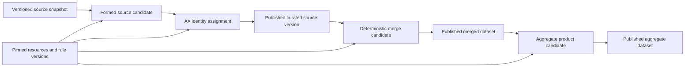

# Plan 002: Port all remaining ingestion, forming, identity, merge, and publication flows

> **Executor instructions**: This is a delivery program with ordered dependency
> waves. The current explicitly authorized implementation coordinates the work
> as six linked OpenSpec changes on one delivery branch. Read the entire plan,
> preserve the dependency order, and run every required verification command.
> If a STOP condition occurs, stop and report it; do not infer missing data
> rules or mint replacement identifiers. Do not describe the program as
> complete until production canaries, rollback rehearsal, and legacy cutover
> are verified for the configured flows.
>
> **Drift check (run first)**:
> `git diff --stat 57506a1..HEAD -- src/lib/api-connections src/lib/imb-forming src/lib/reference-resources src/lib/datasets.ts src/db/schema.ts src/app/api src/app/dashboard src/components/dashboard supabase/migrations tests docs openspec`
>
> The plan was written from commit `57506a1`. If any listed path has changed,
> compare the "Original baseline at planned commit" section with the live implementation before
> proceeding. A semantic mismatch in run artifacts, candidate lineage,
> resource binding, dataset versioning, or publication behavior is a STOP
> condition until the plan is revised.

## Status

- **Priority**: P1
- **Effort**: L (multi-wave program)
- **Risk**: HIGH
- **Depends on**: the current IMB forming foundation, including PR #24 / commit `57506a1`
- **Category**: migration / product direction / data integrity
- **Planned at**: commit `57506a1`, 2026-07-22
- **Status**: Implementation and release verification in progress

### Implementation snapshot (2026-07-22)

This snapshot distinguishes repository support from environment configuration
and production proof. It does not mark the program's done criteria complete.

| Area | Repository state | Remaining environment/release proof |
| --- | --- | --- |
| Foundation and resources | Shared forming contracts, seven versioned resource families, exact launch snapshots, checksum-pinned full-snapshot importer, and characterization fixtures are implemented. | Apply/import the complete retained snapshots and verify the deployed resource health set. |
| Tier 1 sources | IMB, Etnopedia, Joshua Project, WCD, and Accelerate-owned engines and source flows are implemented. IMB/ETNO/JP are code-managed. | Configure the JP secret; bind WCD and Accelerate Sheet/tab profiles and stable keys; run source canaries. |
| AX identity | Transactional reservations, append-only revisions, exact candidate inputs, fixed-manifest graph import, review/publish, cutover gating, and serialized stale cleanup are implemented. | Map every retained Tier 2 component, dry-run/commit the graph, compare a production canary, rehearse forward correction, and freeze the legacy writer at cutover. |
| Tier 1 and Aggregate 1 | Exact release sets, revision compatibility, deterministic products, review gates, expected-current publication, and stable targets are implemented. | Review production comparisons, publish canaries, verify live targets, and rehearse rollback. |
| Tier 2 and Aggregate 2 | Partner profiles, typed resources, forming/identity, exact releases, products, rollback, and profile-aware schedules are implemented. No partner profile is implied by deployment. | Configure each intended partner profile/contract, run one matching canary per profile, then review the combined release canary. |
| Operations | Durable code-defined runs, leases/heartbeats, stale recovery, domain rejection, exact backfills, diagnostics, authenticated continuation, and schedule gating are implemented. | Schedules remain disabled until the matching definition/version/checksum—and Tier 2 profile—has a successful manual production canary. |
| Legacy cutover | Read-only retention and no-dual-write policy are documented. | Preserve final checksummed evidence, approve parity, freeze each matching writer, and verify rollback before AX Online becomes authoritative. |

## Outcome

AX Online will own the complete supported data lifecycle that is currently
spread across AX Data scripts, local folders, Google Drive folders, CSV
ledgers, and Google Sheets:



Every output must be reproducible from immutable source artifacts and exact
resource/rule versions. Building a candidate must never silently replace a
published dataset. Publishing remains an explicit administrator decision with
lineage, findings, actor, reason, and rollback through dataset version history.

The program covers:

1. Tier 1 ingestion and forming for Accelerate-owned Sheets, Etnopedia,
   Joshua Project, IMB, and World Christian Database;
2. one transactional AX identity registry for ROP3-based and UUID-based codes;
3. Tier 1 source publication and field-priority merges;
4. specific-people-group and workers-needed outputs;
5. Aggregate 1 and its derived publications;
6. Tier 2 engagement-partner ingestion, forming, identity, and consolidation;
7. Aggregate 2; and
8. scheduling, backfills, observability, resource refresh impact, and cutover.

## Why this matters

At the planning baseline, AX Online proved the correct lifecycle only for IMB:
archive an upstream snapshot, form a reviewable candidate against pinned
Country/ROP resources, and explicitly publish a dataset version. The remaining
AX Data methodology depended on mutable "latest" files, timestamp folders,
Google Drive discovery, and CSV/Sheet ledgers. Those mechanics made runs hard
to reproduce, let sources advance independently, and made AX-code allocation
unsafe under concurrent web requests. The implementation snapshot above records
how the current candidate replaces those mechanics.

The migration must preserve the valuable rules while replacing the operational
mechanics. The target is not a line-for-line Python port. It is a typed,
versioned, auditable workflow inside AX Online that produces equivalent or
intentionally approved results.

## Non-negotiable product and data decisions

These defaults apply unless a later, reviewed OpenSpec change explicitly
changes them:

1. **Snapshot, form, and publish stay separate.** Ingestion archives source
   data. Forming creates a candidate. Publication is explicit.
2. **A run pins all inputs at start.** Never resolve "latest" source, resource,
   mapping, or priority data midway through a run.
3. **Source-specific rules remain source-specific.** Reuse one lifecycle and
   executor, but keep AX, ETNO, IMB, JP, WCD, and engagement-partner contracts
   in named modules. Do not build a user-programmable ETL language.
4. **One authoritative AX registry.** Replace the legacy ROP3 and UUID files
   with transactional records, namespaces, source bindings, aliases, and unique
   constraints. Do not dual-write old and new ledgers.
5. **Published versions are immutable history.** A new publish may update the
   current dataset but must archive the previous version using the existing
   dataset-version system.
6. **Merges bind exact source versions.** A Tier 1 or Tier 2 merge may not use
   each source's independently resolved latest output.
7. **Provenance is retained.** Consumer datasets may hide `src__*` columns, but
   the candidate package and lineage must retain the winning source for every
   selected value.
8. **Warnings are bounded and explicit.** A configured warning may permit a
   candidate; errors block publication. Missing identifiers, conflicting AX
   allocations, ambiguous merge precedence, and broken lineage are errors.
9. **No new recurring service is required.** Use the existing Next.js,
   Supabase/Postgres, Supabase Storage, and Vercel deployment architecture.
10. **Legacy behavior is evidence, not automatically truth.** Characterize it,
    compare it, and record intentional changes instead of copying known
    inconsistencies.

## Original baseline at planned commit

The following section records the baseline used to write this plan at commit
`57506a1`; it is not a claim about the current worktree. The implementation
snapshot above and the active OpenSpec changes describe the current candidate.

### AX Online foundations to reuse

- `src/lib/api-connections/index.ts` owns connection runs, logs, immutable raw
  and parsed artifacts, checksums, and provider execution.
- `src/lib/api-connections/provider.ts` defines the provider seam. Existing
  providers cover Google Sheets, Etnopedia, ArcGIS/IMB, and generic HTTPS.
- `src/lib/api-connections/index.ts:168-218` defines code-managed IMB,
  Etnopedia, and Joshua Project connections. WCD and Accelerate-owned sources
  can use the existing Google Sheets connection model.
- `src/db/schema.ts:831-922` stores connection runs and their immutable artifact
  paths/checksums.
- `src/db/schema.ts:924-1038` stores forming runs and row-level findings, but
  the TypeScript types and policy are currently IMB-specific.
- `src/lib/imb-forming/index.ts` implements candidate creation, artifact
  validation, rejection, publication, and dataset replacement/versioning.
- `src/lib/imb-forming/engine.ts` implements the first typed field contract,
  Country/ROP matching, stable row identity, validation, and checksums.
- `src/lib/imb-forming/resources.ts` pins a Country and ROP resource set.
- `src/lib/imb-forming/policy.ts` intentionally rejects non-IMB sources today.
- `src/lib/datasets.ts` and `src/db/schema.ts:1-128` already provide current
  datasets plus archived dataset versions and rows.
- `src/lib/reference-resources/` and `src/db/schema.ts:358-568` provide the
  versioned private resource catalog and atomic resource sets.

At commit `57506a1`, an IMB import does **not** publish raw source rows. It
archives them, then a separate forming run produces a candidate. The current
IMB candidate normalizes fields and uses Country/territory and ROP resources,
but it does not yet assign AX codes or participate in multi-source merges.

### AX Data methodology to preserve

The legacy repository is `/Users/blake/Documents/accelerate-global/data`.
The authoritative behavior must be characterized from code and fixtures, not
only its documentation, because the repository contains divergent scripts,
latest-file discovery, legacy fallbacks, and planned-but-unwritten flow docs.

#### Source and forming inventory

| Flow | Ingestion | Forming steps to preserve | Important validation/resources |
| --- | --- | --- | --- |
| AX / Accelerate-owned data | Google Sheets, possibly multiple tabs/prefixes | IDs → field mapping → ISO3 → country name → semantic types → duplicates | Database Sources, AX field map, Country resource, field/type contract |
| Etnopedia | MediaWiki export; provider already exists online | IDs → field mapping → country discovery → ISO3 → ROP1 from ROP3 → semantic types | Database Sources, ETNO field map, Country resource, ROP hierarchy; legacy blank/unmapped ROP3 row drops require explicit parity decision |
| IMB | ArcGIS adapter already works online | Existing online forming, then AX identity assignment | Country and ROP resources; current online contract is the migration exemplar |
| Joshua Project | Code-managed HTTPS connection already exists online | IDs → field mapping → ISO3 → country name → semantic types → duplicate checks | API secret, Database Sources, JP field map, Country resource, duplicate `(PG_ROP3, Geo_ISO3)` rule |
| WCD | Private Google Sheet | IDs → field mapping → ISO3 → country name → semantic types → duplicate checks | WCD field map, Country resource, `ROP People code` fallback to `PG_ROP3`, duplicate `(PG_ROP3, Geo_ISO3)` rule |
| Tier 2 engagement partners | Existing/private partner Google Sheets | IDs → field mapping → ISO3 → country → ROP3 → ROP1 → semantic types | Engagement field map, Country, ROP, JP PeopleID3, PEID; `tracking_id_source` determines identifier interpretation |

Legacy source code locations:

- `tier_1/00_incoming_datasets/` — source acquisition.
- `tier_1/03_processing/{ax,etno,imb,jp,wcd}/` — per-source forming.
- `tier_2/01_sources/engagement_data_picker.py` and
  `tier_2/03_processing/engagement_partners/` — Tier 2 input and forming.

#### Identity behavior to preserve deliberately

- `tier_1/05_ax_code/01_apply_ax_code.py` assigns deterministic ROP3-based PGAC
  and PGIC values and keeps prior values as aliases in a separate ROP3 ledger.
- `tier_1/05_ax_code/02_update_uuid_ledger.py` handles rows without ROP3. It
  matches by `Dataset_Row_Key`, reuses existing six-digit UUID values, and only
  mints a new value when neither source nor ledger supplies one.
- ROP3-derived values use normalized ROP1, source initials, six-digit ROP3, and
  ISO3. UUID-derived values use normalized ROP1, source initials, a six-digit
  allocated UUID, and ISO3.
- Existing nonblank source identity values are generally retained unless an
  explicit reconcile mode is selected.
- Missing `Dataset_Row_Key`, invalid preexisting UUID, and conflicting primary
  values must not be silently repaired.

The old files under `resources/AX_UUID*` and Drive/Sheets are not an acceptable
runtime store in AX Online. They are migration inputs only.

#### Merge and publication inventory

| Product | Legacy behavior that needs a reviewed online equivalent |
| --- | --- |
| Tier 1 merged people groups | Merge by AX PGIC; select each field by a versioned priority table; default fallback JP → IMB → AX → ETNO → WCD; retain provenance |
| Tier 1 specific PGs | Group rows by ROP3 + ISO3, retain contributing sources, and choose values deterministically |
| Workers needed | `ceil(PG_Population / 50000)` for both merge variants; invalid/missing population yields blank plus finding |
| PGAC Aggregate 1 | Group specific-PG output by ROP3, sum population, recompute weighted percentages, choose primary country, retain alt countries and source flags, resolve other fields by provenance/priority |
| PGAC Self-Engaged | Apply the documented GSEC, frontier, believer, evangelical percentage, and engagement-scale rules |
| Watchlist | Apply GSEC/source, frontier/source, believer, and evangelical percentage thresholds |
| Baseline UUPG List | Filter Watchlist to unengaged rows, including the JP frontier-source condition |
| Baseline UUPG Hotspots | Rank primary countries by summed PG population and retain the deterministic top 10 |
| South Asia | Filter Aggregate 1 by the explicit normalized country set |
| Tier 2 merged people groups | Stack AX-coded engagement datasets; duplicate AX codes are blocking conflicts rather than priority merges |
| Aggregate 2 | Combine exact Tier 2 outputs with exact curated IMB/JP inputs; retain all rows/provenance and surface duplicate identity conflicts |

Legacy implementations are in `tier_1/06_merging/`, `merge_workflows/`,
`tier_2/06_merging/`, and `aggregate_2/agg_2.py`. The empty or incomplete
`aggregate_1/google_sheet_agg_1_push.py` is not a canonical flow and must not
drive the port.

### Resource inventory to bring under AX Online

Country/territory and ROP are only the first two resources. The remaining
rules currently live in files or Sheets and must become versioned resources or
versioned code contracts:

| Resource family | Target representation |
| --- | --- |
| Country/territory and ROP hierarchy | Existing resource catalog and resource sets |
| Source registry / aliases (`Database_Sources`) | Versioned tabular resource |
| Per-source field maps | Versioned code contract initially; optionally imported tabular source with reviewed activation |
| Per-source semantic type rules | Versioned code contract with checksum |
| JP PeopleID3 and PEID crosswalks | Versioned tabular resources |
| Engagement partner field/template mapping | Versioned tabular resource or code contract, pinned per candidate |
| AX identity ledger and aliases | Transactional registry tables, not a reference file |
| Tier 1 field priority | Versioned tabular resource, pinned per merge |
| Aggregate 1 and Aggregate 2 field mappings | Versioned code/rule contracts with checksums |
| Add-on/derived-field definitions | Versioned rule contracts |

## Target architecture

### Shared lifecycle, source-specific rules

Refactor the IMB-only module into a shared forming lifecycle without removing
the source-specific engine:

```text
src/lib/dataset-forming/
  index.ts                 # lifecycle: start, build, reject, publish, download
  registry.ts              # connection/source profile -> source engine
  policy.ts                # shared state/decision policy
  resources.ts             # generic binding/checksum validation
  storage.ts               # candidate artifacts
  types.ts
  engines/
    imb.ts
    etnopedia.ts
    joshua-project.ts
    wcd.ts
    accelerate.ts
    engagement-partner.ts
```

Each engine returns the same result envelope:

```ts
type FormingResult = {
  columns: CsvColumn[];
  rows: Record<string, string>[];
  findings: FormingFinding[];
  validation: FormingValidationSummary;
  fieldContract: VersionBinding;
  transformation: VersionBinding;
  resources: ResourceVersionBinding[];
  outputChecksum: string;
  valid: boolean;
};
```

The lifecycle owns state, checksums, artifacts, actor decisions, and dataset
publication. An engine owns source fields, conversions, required resources,
stable row keys, and validation. No engine writes a dataset directly.

### Workflow and artifact model

Add a small explicit model instead of a generic DAG platform:

- `pipeline_definitions` or a code registry identifies supported named flows.
- `pipeline_runs` represents forming, identity, merge, and aggregate builds.
- `pipeline_run_inputs` binds exact connection-run artifacts, dataset versions,
  registry snapshots, resource versions, and upstream pipeline outputs.
- `pipeline_artifacts` stores rows/CSV/findings/manifest paths and checksums.
- `pipeline_findings` stores reviewable warnings/errors.
- Existing `dataset_forming_runs` may be generalized/migrated into this model,
  or retained as the source-forming specialization. Decide in Wave 1 and avoid
  maintaining two parallel lifecycle implementations.

Use code-defined pipeline definitions with version/checksum values. Do not add
an in-product arbitrary workflow editor.

### AX identity registry

Create private, RLS-protected tables with at least:

- identity subject/primary record;
- namespace or identity kind (`rop3` and `uuid` initially);
- canonical PGAC and PGIC values;
- allocated six-digit UUID when applicable;
- normalized ROP1, ROP3, source code, and ISO3 components;
- source-row bindings keyed by connection/source profile + `Dataset_Row_Key`;
- aliases and supersession history;
- allocation/publish actor and timestamps;
- source candidate and rule checksum lineage.

Required database constraints:

- one active binding per source profile + stable row key;
- unique active canonical PGAC and PGIC values;
- unique allocated UUID within its namespace;
- an alias cannot be the canonical value of a different active identity;
- published bindings cannot be hard-deleted;
- allocation occurs in one transaction with advisory or row locking so two
  requests cannot mint the same value.

Identity assignment creates a reviewable candidate. It may reserve identifiers
transactionally, but publication is the point at which the source dataset
version and registry binding become authoritative together. Define expiration
or cancellation behavior for abandoned reservations in the OpenSpec change.

### Merge and aggregate candidates

Merge inputs must be selected as a named release set:

```ts
type ReleaseSet = {
  tier: "tier1" | "tier2";
  inputs: Array<{
    sourceProfile: string;
    datasetId: string;
    datasetVersionId: string;
    checksum: string;
  }>;
  resourceSetId: string;
  identityRegistryRevision: string;
  ruleVersion: string;
  ruleChecksum: string;
};
```

A merge/aggregate build must fail if an input version, checksum, rule binding,
or registry revision no longer matches. The candidate stores both provenance
and consumer variants. Publication may expose only the consumer variant while
retaining provenance artifacts privately.

## Commands executors will need

Run `pnpm run verify:change` at the start of every OpenSpec wave to obtain the
exact commands for that wave. The following are current repository gates:

| Purpose | Command | Expected on success |
| --- | --- | --- |
| Change impact | `pnpm run verify:change` | exit 0; lists owned paths and required commands |
| Kickoff | `pnpm run task:kickoff -- --scope '<owned paths/glob>'` | exit 0; records verification lane and dirty-path boundaries |
| Fast feedback | `pnpm run verify:fast` | exit 0 |
| OpenSpec | `pnpm run spec:validate` | exit 0 |
| UI contract | `pnpm run smoke:check` | exit 0 |
| Full pipeline resources (local) | `pnpm run pipeline-resources:import:local` | all five exact retained snapshots validate and activate into a healthy resource set |
| Full pipeline resources (linked) | `pnpm run pipeline-resources:import:remote` | the linked environment receives the same checksum-pinned immutable packages |
| Legacy identity graph dry run | `pnpm run identity-registry:legacy-import:local -- --manifest <reviewed-manifest>` | no authority mutation; prints the exact graph report, fingerprint, and state-bound commit token |
| Terminal change gate | `pnpm run verify:change:run` | exit 0; every required check passes |
| Pre-ship | `pnpm run verify:ship:local` | exit 0 after the wave's OpenSpec change is archived |

For UI-affecting waves, run the targeted smoke subset printed by
`pnpm run verify:change`; browser smoke must run outside the macOS sandbox as
required by `AGENTS.md`. For database waves, run the migration/security commands
printed by the change gate and stop the repo-local Supabase/Docker stack before
finishing.

## Program scope and boundaries

### In scope

- Generalize source forming while preserving the current IMB behavior.
- Add remaining source contracts and required resource versions.
- Add transactional AX identity assignment and legacy-ledger import.
- Add deterministic Tier 1/Tier 2 merge candidates.
- Add named Aggregate 1 and Aggregate 2 candidates.
- Add explicit publish/reject/rebuild operations and lineage UI.
- Add scheduling/backfill controls only after manual flows are proven.
- Add golden parity fixtures and cutover reports.

### Out of scope

- Connecting the AX Online runtime to the AX Data repository or its folders.
- Running Python scripts from Next.js/Vercel.
- Preserving Drive timestamp-folder layouts as application architecture.
- A no-code ETL builder or user-authored transform language.
- Automatically publishing every successful ingestion.
- Reassigning or compacting existing AX identifiers.
- Deleting legacy ledgers before reconciliation and signed cutover.
- Silently correcting legacy data where the intended rule is ambiguous.
- Porting unused, empty, or unreachable scripts solely for file parity.

## Git and OpenSpec workflow

- The original execution model assumed a separate branch/change per wave. The
  current explicitly authorized delivery uses one branch and six linked
  OpenSpec changes: foundation, Tier 1 source forming, AX identity, Tier 1
  products, Tier 2 products, and operations.
- Preserve the wave dependency order inside that coordinated delivery. Before
  changing each owned area, run exploration, `pnpm run verify:change`, then
  `pnpm run task:kickoff -- --scope '<owned paths>'` when required by repo policy.
- Use the repository's imperative commit style, for example
  `Generalize dataset forming lifecycle`.
- Verify all six changes together, then archive each after its requirements and
  tasks are proven, before the pre-ship gate. A future follow-up outside this
  authorized delivery still receives its own scoped OpenSpec change.
- Do not enable a dependent production flow until its prerequisites and exact
  environment canaries are verified, even though the source changes travel in
  one coordinated release.

## Execution waves

### Wave 0: Freeze and characterize the legacy behavior

**Goal:** Create a reviewed behavior contract and safe comparison corpus before
porting more rules.

1. Create an OpenSpec change for legacy characterization and the target stage
   contract.
2. Add `docs/data-pipeline/flow-inventory.md` with every source, processing
   step, resource, identity rule, merge, aggregate product, and publication.
   Mark each rule `confirmed by code`, `confirmed by fixture`, `documented
   only`, `conflicting`, or `unused`.
3. Export representative, non-secret fixtures from existing retained artifacts:
   at minimum normal rows, missing identifiers, country aliases, unknown
   country, ROP3 present/absent, duplicate domain keys, invalid numeric/boolean
   values, schema drift, and cross-source conflicts.
4. Record expected row counts, columns, per-rule findings, identity results,
   merge winners, provenance, and aggregate totals. Store only sanitized fixture
   data in `tests/fixtures/pipelines/`.
5. Add a decision log for known legacy ambiguities, including:
   - Etnopedia dropping blank or unmapped ROP3 rows;
   - whether source-provided AX values can ever override registry values;
   - Tier 1 versus Tier 2 UUID namespaces;
   - Tier 2 duplicate AX-code behavior;
   - exact precedence when a priority mapping is missing;
   - publication names/classifications and which datasets are workspace-visible.
6. Build a read-only legacy comparison command that accepts fixed fixture
   inputs; do not require live Drive or provider access for tests.

**Owned paths:** `docs/data-pipeline/**`, `tests/fixtures/pipelines/**`, a small
test-only comparison harness under `scripts/` if necessary, `openspec/**`.

**Verify:**

- `pnpm run spec:validate` → exit 0.
- The selected fixture test command from `verify:change` → exit 0 and stable
  expected outputs on two consecutive runs.
- `git status --short` → no downloaded production artifacts or credential files.

**Exit gate:** Product/data owner reviews every `conflicting` decision. No
identity or merge implementation begins with an unresolved rule.

### Wave 1: Generalize the IMB candidate lifecycle

**Goal:** Make forming source-agnostic without changing IMB output.

1. Create the shared `src/lib/dataset-forming/` lifecycle and source-engine
   registry described above.
2. Move or wrap IMB engine, policy, resources, storage, types, and routes behind
   the shared interfaces. Keep backward-compatible route/UI behavior during the
   migration.
3. Generalize database status and JSON types currently named for IMB. Add a
   source profile/engine key, engine version/checksum, generic resource bindings,
   and artifact schema version. Prefer additive migration, backfill existing IMB
   rows, switch reads/writes, then remove obsolete columns/types only in a later
   safe migration.
4. Make publication transactional around candidate state and dataset version
   creation as far as the current storage/DB boundary allows. On partial storage
   failure, leave a retryable candidate with a normalized error and no false
   `published` state.
5. Preserve exact IMB source artifacts, output checksum, findings, and published
   dataset behavior. Add golden tests proving no output drift.
6. Update the run-detail drawer to render the generic candidate model. Do not
   expose internal UUIDs/checksums as unbroken overflow text; use labeled,
   copyable/truncated values.

**Primary paths:** `src/lib/dataset-forming/**`, `src/lib/imb-forming/**`,
`src/db/schema.ts`, new Supabase migration(s), existing forming API routes,
connection detail components/tests, `tests/ui/route-registry.ts`, `openspec/**`.

**Verify:**

- Existing IMB engine, lifecycle, route, and component tests all pass.
- New generic lifecycle tests cover build success, invalid candidate, reject,
  publish, publish retry, checksum mismatch, stale build, and unsupported engine.
- `pnpm run smoke:check` → exit 0.
- `pnpm run verify:change:run` → exit 0.

**Exit gate:** A production IMB ingestion can build and publish through the new
generic lifecycle with the same row count/checksum as the pre-wave fixture.

### Wave 2: Version the remaining forming resources and contracts

**Goal:** Make all non-identity inputs pin-able and reviewable in AX Online.

1. Extend the resource catalog for source aliases, JP PeopleID3, PEID, Tier 1
   merge priorities, engagement mappings, and any tabular field contracts chosen
   in Wave 0.
2. For code-defined contracts, add version constants and deterministic
   checksums. A mapping change must change its version or checksum and make
   earlier candidates reproducible.
3. Extend resource sets so a source engine declares its required resource keys.
   A set is valid only when all required resources are valid and checksummed.
4. Add refresh/build validators per resource: schema, uniqueness, active flags,
   cross-reference integrity, and bounded missing-parent warnings where already
   approved.
5. Extend the Resources UI with source, updated time, lifecycle state only when
   action is required, row counts, and impacted pipelines. Valid resources need
   no positive-status label.
6. Add a resource-impact query: show which latest candidates/publications used
   an older version, but do not automatically rebuild or publish them.

**Primary paths:** `src/lib/reference-resources/**`, `src/db/schema.ts`, new
migrations, Resources pages/components/routes/tests, `openspec/**`.

**Verify:** Each resource accepts a valid fixture, rejects duplicate/invalid
keys, persists an immutable version, binds into a valid set, and reports
affected pipeline definitions. Run `pnpm run smoke:check` and
`pnpm run verify:change:run` to green.

### Wave 3: Port Tier 1 source forming and publication

**Goal:** Produce reviewable, publishable candidates for each Tier 1 source.

Implement one source per PR in this recommended order:

1. **Etnopedia** — ingestion provider already exists; port IDs, field mapping,
   country/ISO3, ROP1 derivation, types, and the reviewed ROP3 retention policy.
2. **Joshua Project** — ingestion connection already exists; port IDs, fields,
   country/ISO3, types, duplicate validation, and resources/profile fields.
3. **WCD** — use an admin-managed Google Sheets connection/source profile;
   port IDs, fields, `ROP People code` fallback, country/ISO3, types, duplicates.
4. **Accelerate-owned datasets** — use Google Sheets profiles and an explicit
   source-profile key per tab/prefix; port IDs, mapping, country/ISO3, types,
   duplicates without relying on folder names.
5. **IMB parity completion** — adopt any shared validation improvements but do
   not add AX codes until Wave 4.

For every source:

- define required columns, known exclusions, stable row-key construction,
  field map, semantic types, Country/ROP behavior, validation severity, and
  output ordering;
- archive raw and parsed ingestion artifacts before forming;
- bind source checksum, contract checksum, transformation checksum, and exact
  resource versions;
- support build/rebuild, reject, artifact download, and explicit publish;
- publish to one stable curated dataset target using dataset version history;
- add golden source fixtures and schema-drift tests;
- show the candidate in the existing run detail, with no source-specific
  one-off page.

**Verify per source:**

- adapter contract tests pass for pagination/parsing/error redaction;
- golden forming output and findings match the Wave 0 approved contract;
- a changed resource set produces a distinct candidate without altering the
  old one;
- duplicate stable row keys and missing required identifiers block publish;
- targeted UI smoke plus `pnpm run verify:change:run` pass.

**Exit gate:** All five Tier 1 sources have a currently published curated
dataset version built from immutable source runs. Do not start identity
allocation against unpublished/raw rows.

### Wave 4: Import and activate the AX identity registry

**Goal:** Replace mutable AX ledgers with one safe, audited registry.

1. Create an OpenSpec change defining code formats, namespace rules,
   reservation/publish behavior, reconciliation, alias history, and permissions.
2. Add private registry tables and constraints described in Target architecture.
3. Implement pure functions for normalization and deterministic ROP3-based
   PGAC/PGIC construction. Add property tests for formatting and stability.
4. Implement transactional UUID allocation for no-ROP3 rows. Test parallel
   allocations, retries, source-supplied UUIDs, exhausted/invalid ranges, and
   rollback.
5. Build a one-time import tool for retained ROP3/UUID ledgers. It must:
   - read explicit supplied snapshots, never "latest";
   - checksum and record the inputs;
   - dry-run by default;
   - report duplicate canonical values, duplicate UUIDs, key conflicts,
     malformed codes, alias collisions, and orphan source bindings;
   - refuse commit while blocking conflicts remain; and
   - be idempotent on the same snapshots.
6. Reconcile imported identities to formed Tier 1 source rows by stable row key.
   Do not match only on names.
7. Add an identity candidate stage after source forming. It shows reused,
   source-retained, newly reserved, conflicting, and unassignable counts.
8. Publish the identity-enriched source dataset and registry bindings in one
   controlled operation. Keep the un-enriched formed candidate as immutable
   lineage.
9. Add an admin-only registry UI for search, source bindings, aliases, history,
   and conflict review. Do not permit arbitrary editing of canonical codes in
   the first release.

**Verify:** migration/security tests; allocation concurrency tests; import
idempotency; zero duplicate active canonical codes/UUIDs; legacy-vs-new
assignment comparison on all fixtures; UI smoke; `pnpm run verify:change:run`.

**Exit gate:** The imported registry reconciles with the approved legacy
snapshots and new allocations remain stable across rebuilds. Freeze legacy
ledger writes before activating new publication. Keep read-only backups.

### Wave 5: Build Tier 1 merge candidates and derived fields

**Goal:** Replace Drive-based latest-source merging with deterministic release
sets.

1. Add release-set selection that binds one exact identity-enriched dataset
   version for AX, ETNO, IMB, JP, and WCD.
2. Port field-level priority selection. Pin the priority resource version and
   retain `src__<field>` provenance. Sort source rows and fields explicitly so
   the same inputs always yield the same checksum.
3. Implement the default fallback JP → IMB → AX → ETNO → WCD only where the
   approved priority contract has no entry. Emit a finding for every fallback
   field so missing configuration is visible.
4. Build both variants:
   - merged people groups keyed by canonical AX PGIC;
   - specific PGs keyed by normalized ROP3 + ISO3 with contributing sources.
5. Treat conflicting canonical identity, ambiguous priority ties, missing merge
   keys, and duplicate source bindings as blocking errors.
6. Add workers-needed as a versioned derived-field rule. Preserve
   `ceil(population / 50000)`; invalid population yields blank plus finding.
7. Produce private provenance artifacts and reviewable consumer candidates.
   Publish each product to a stable dataset with version history.

**Tests:** permutation/determinism tests, priority winner matrix, fallback
findings, blank-vs-zero behavior, cross-source collisions, specific-PG grouping,
workers rounding/invalid inputs, lineage tamper detection, rollback.

**Exit gate:** New Tier 1 merge outputs match approved fixture totals and field
winners, with every difference from the legacy output explained in the
comparison report.

### Wave 6: Port Aggregate 1 and its named publications

**Goal:** Create versioned, reviewable Aggregate 1 products without Drive
handoffs.

Implement the products as separate named definitions sharing the generic
candidate lifecycle:

1. **PGAC Aggregate 1** from the exact specific-PG merge version:
   group by ROP3; sum population; recompute weighted Christianity percentages;
   select primary country by highest population; list alternatives; derive
   source flags and Joint; apply versioned field priorities.
2. **PGAC Self-Engaged** using the approved GSEC, frontier, minimum believer,
   evangelical percentage, and AX engagement-scale branches.
3. **Watchlist** using the approved provenance-aware GSEC/frontier and
   evangelical thresholds.
4. **Baseline UUPG List** from an exact Watchlist version and the engagement/
   JP-frontier rule.
5. **Baseline UUPG Hotspots** from an exact Baseline version; deterministic top
   10 primary countries by total population, alphabetical tie-break.
6. **South Asia** from an exact Aggregate 1 version and an explicit normalized
   country scope resource/contract.

Each child product binds the exact parent dataset version and its own rule
checksum. A later parent publication must mark the child as out of date without
mutating or automatically replacing it.

**Tests:** weighted percentage math, decimal formatting, provenance-specific
gates, thresholds at/below/above boundaries, missing values, country ties,
country aliases, parent-version pinning, deterministic output, publish rollback.

**Exit gate:** All named products have side-by-side comparison reports and
explicit owner approval. Google Sheets may be an optional export destination
after publish, not the authoritative dataset.

### Wave 7: Port Tier 2 engagement-partner forming and identity

**Goal:** Give every engagement-partner dataset the same snapshot → candidate →
identity → publish lifecycle.

1. Define an admin-managed source profile for each partner Sheet. Use connection
   identity, not filename/folder discovery, as the durable profile key.
2. Port the Tier 2 contract: IDs, fields, Country/ISO3, ROP3, ROP1, and semantic
   types.
3. Pin JP PeopleID3 and PEID resource versions. Implement
   `tracking_id_source` as a typed discriminator and emit an error for unknown
   types; never guess the identifier family.
4. Preserve the reviewed behavior for existing nonblank ROP3 values versus
   computed candidates. Invalid existing values must produce a finding and the
   approved retain/clear policy from Wave 0.
5. Reuse the AX identity registry with an explicit Tier 2 namespace or subject
   type if Wave 0 confirms separation. Do not create another CSV ledger.
6. Publish one stable curated dataset per partner source with version history.
7. Add batch release-set selection for all partner datasets intended for a
   Tier 2 release.

**Tests:** each tracking-ID source type, missing/ambiguous crosswalks, valid and
invalid existing ROP3, field-map drift, registry reuse, parallel allocations,
multi-partner release-set completeness.

### Wave 8: Port Tier 2 merge and Aggregate 2

**Goal:** Publish deterministic Tier 2 and Aggregate 2 versions from exact
inputs.

1. Build Tier 2 merge candidates from an exact release set of partner dataset
   versions. Preserve the approved rule that duplicate canonical AX codes are
   blocking conflicts; do not merely keep both rows without a visible error.
2. Retain provenance and source membership for every row.
3. Define Aggregate 2's exact inputs. Replace legacy independent "latest IMB"
   and "latest JP" resolution with explicit version bindings in the release
   set.
4. Port the approved Aggregate 2 mapping/field rules. If Wave 0 determines the
   legacy implementation is only a stack rather than a true merge, name the
   online product accurately and document that outcome.
5. Publish Tier 2 merge and Aggregate 2 through stable dataset targets with
   version history.

**Tests:** release completeness, duplicate identity conflicts, input-order
permutation, exact IMB/JP version pinning, provenance, output checksum,
publication retry and rollback.

### Wave 9: Add operations, scheduling, and retire legacy execution

**Goal:** Make the proven manual workflows reliable to operate without turning
the web request into a long-running monolith.

1. Define a small run coordinator with idempotent stage transitions, retries,
   stale-run recovery, and correlation IDs. Use the existing deployment stack;
   do not add infrastructure until measured runtime limits require it.
2. Run long builds in bounded chunks with durable progress. Never rely on one
   browser request staying open.
3. Add manual `Run pipeline` and `Rebuild with current resources` controls,
   then add schedules only for source profiles whose manual flow is stable.
4. Add a pipeline history view showing source, formed, identity, merge,
   aggregate, and publication stages, exact input versions, findings, actor,
   duration, row counts, and current/out-of-date state.
5. Add alerts/diagnostics for failed ingestion, invalid resources, blocked
   candidates, identity conflicts, stale runs, and publication failures. Avoid
   restoring broad product analytics.
6. Add backfill controls that select explicit historical source/resource
   versions. Backfills never overwrite current published data until explicitly
   published.
7. After production parity and owner signoff, disable AX Data scheduled/manual
   writes, retain read-only archives and reconciliation reports, and update
   architecture/operations documentation.

**Verify:** restart/stale-run tests, idempotent retry tests, chunk boundary
tests, scheduled run authentication, production smoke of one manual pipeline,
and `pnpm run verify:change:run`.

## Cross-wave test strategy

Every wave must add persistent tests in the same diff as implementation.

### Pure transformation tests

- Golden fixtures for every source and named aggregate.
- Boundary and malformed-value cases for every semantic conversion.
- Stable output and checksum across repeated runs.
- Input-order permutation tests for merges and aggregates.
- Schema drift appears as findings rather than silently changing output.

### Database and concurrency tests

- RLS denies non-admin access to private run, artifact, and registry data.
- Unique constraints prevent duplicate active identifiers and bindings.
- Parallel UUID reservations cannot allocate the same value.
- Retry after a failed transaction is idempotent.
- Published lineage cannot be deleted or rebound accidentally.
- Resource and dataset versions referenced by lineage use restrictive deletion.

### Lifecycle tests

- ingestion success does not imply publication;
- invalid candidate cannot publish;
- warning acknowledgement and reason rules;
- reject and rebuild create immutable history;
- stale resource/rule inputs mark a publication out of date but do not mutate it;
- checksum or manifest tampering blocks publish;
- storage failure cannot create a false published state;
- exact previous dataset version remains recoverable.

### UI smoke and accessibility

- every changed/new page has a route-registry entry and literal smoke marker;
- candidate drawer/sheets expose smoke trigger/surface/ready attributes;
- tables and drawers remain usable at desktop and narrow widths;
- destructive or publishing actions require clear confirmation and focus return;
- status language distinguishes current, out-of-date, failed, blocked, and
  published states.

### Production verification

For each source/product cutover:

1. ingest the same retained source snapshot in legacy and online paths;
2. compare row/column counts and checksums where formats permit;
3. compare formed field values and findings;
4. compare AX identity reuse/new allocation with zero unexplained collisions;
5. compare merge membership, winning values, and provenance;
6. compare aggregate totals and filter membership;
7. have the data owner approve every intentional difference;
8. publish one canary version, verify the live dataset, then activate the source.

## Cutover and rollback

1. Keep AX Data read-only-capable throughout the migration.
2. Cut over one source or product at a time; do not switch Tier 1 and Tier 2 in
   one release.
3. Before registry activation, freeze legacy ledger writes and record checksums
   of the final source ledgers.
4. Import and reconcile; do not dual-write both identity systems.
5. Shadow-build online candidates while legacy remains the published source.
6. After parity approval, publish the online dataset version and update only
   downstream release sets that explicitly select it.
7. Product rollback means selecting an exact retained publication and the
   reviewed current target, verifying its immutable evidence, and appending a
   new target-aware rollback publication. Source correction rebuilds from an
   exact retained release set. Suspend new identity publication during
   correction; never delete or renumber allocated AX identities to simulate
   rollback.
8. Retain legacy snapshots, import reports, comparison reports, and mapping
   decisions for audit.

## Done criteria

All items must hold before this program is marked complete:

- [ ] Every flow in the source/merge/publication inventory is implemented or
      explicitly rejected as unused with owner approval.
- [ ] Every source run archives immutable raw and parsed artifacts with checksums.
- [ ] Every formed, identity, merge, and aggregate candidate pins exact input,
      resource, rule, and output checksums.
- [ ] AX identity allocation is transactional, unique, idempotent, and audited.
- [ ] No production flow reads runtime inputs from AX Data folders or resolves
      Drive "latest" files.
- [ ] Tier 1, Tier 2, Aggregate 1, and Aggregate 2 publish stable dataset
      versions through the existing version-history model.
- [ ] Every intentional legacy-output difference has a reviewed decision record.
- [ ] Golden, lifecycle, security, concurrency, and UI smoke tests pass.
- [ ] Every wave's `pnpm run verify:change:run` and pre-ship gate passed.
- [ ] Every OpenSpec change is verified and archived.
- [ ] Production canary and live URL flows were verified for every cutover.
- [ ] Legacy writers are disabled only after final parity and rollback signoff.
- [ ] `plans/README.md` marks Plan 002 implemented and verified.

## STOP conditions

Stop and report; do not improvise if any of these occurs:

- The current IMB lifecycle no longer matches the foundation described here.
- A legacy rule disagrees with its fixture, docs, or another active script and
  no approved decision exists.
- Any source lacks a stable row key that survives refreshes.
- The final legacy AX ledgers contain duplicate active UUIDs/canonical codes,
  alias collisions, or conflicting bindings that cannot be reconciled exactly.
- An implementation would mint or reassign AX identifiers before the registry
  migration/reconciliation gate passes.
- A merge priority is missing/ambiguous for a field whose fallback has not been
  approved.
- A proposed run resolves an input/resource as "latest" after the run begins.
- A publish path can update a dataset without retaining its prior version and
  full candidate lineage.
- Production parity has unexplained row membership, identity, field winner, or
  aggregate total differences.
- Provider credentials/access are missing for a real-system verification. Do
  all fixture and local work first, then request only the smallest access step.
- A wave requires a new paid service or security-permission expansion not
  authorized in its OpenSpec change.
- Any required repository check fails twice after a targeted reasonable fix.

## Maintenance notes

- A source mapping, semantic conversion, merge priority, or aggregate threshold
  change is a versioned rule change, not an in-place edit to history.
- Adding a new source means implementing a provider/source profile and forming
  engine, then opting it into identity and release sets. It must not add another
  lifecycle.
- Country/ROP/PEID/PeopleID3 refreshes should mark affected candidates and
  publications out of date; they should not trigger automatic publication.
- Reviewers should scrutinize identity uniqueness, stable row-key construction,
  exact version bindings, output determinism, storage/DB partial failure, and
  whether warning severity permits unsafe data through.
- Google Sheets/Drive can remain optional export destinations, but AX Online's
  database/storage lineage is the source of truth after cutover.
